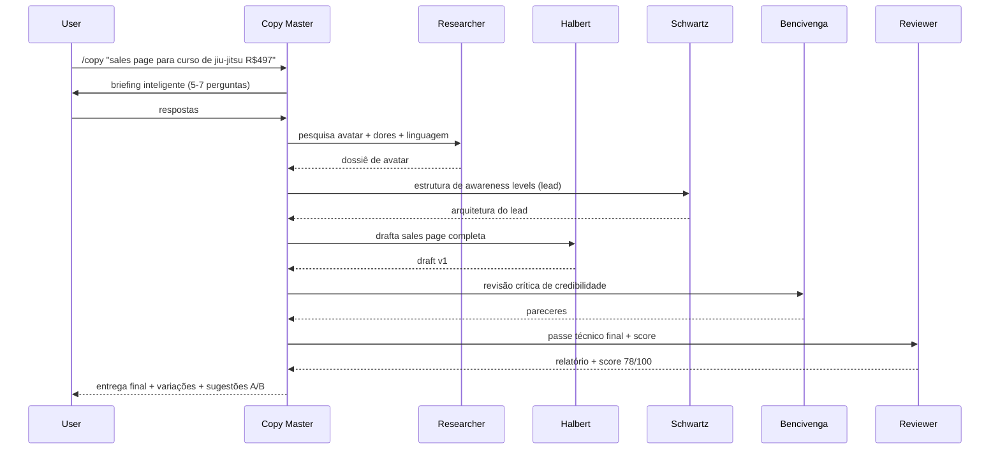
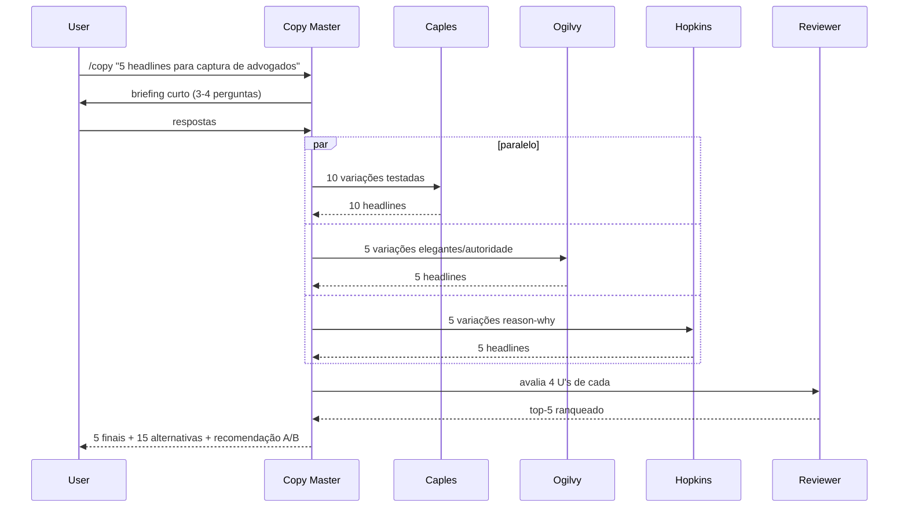
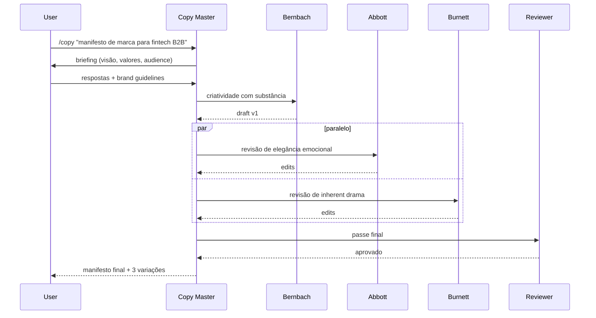
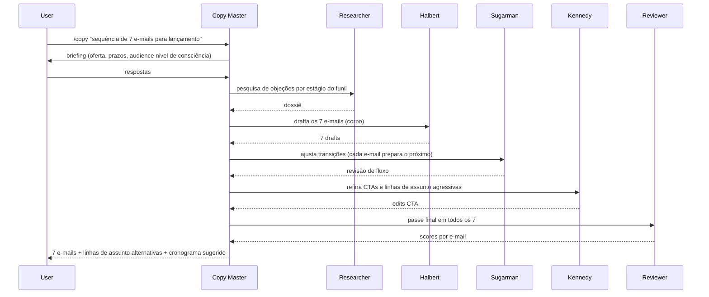
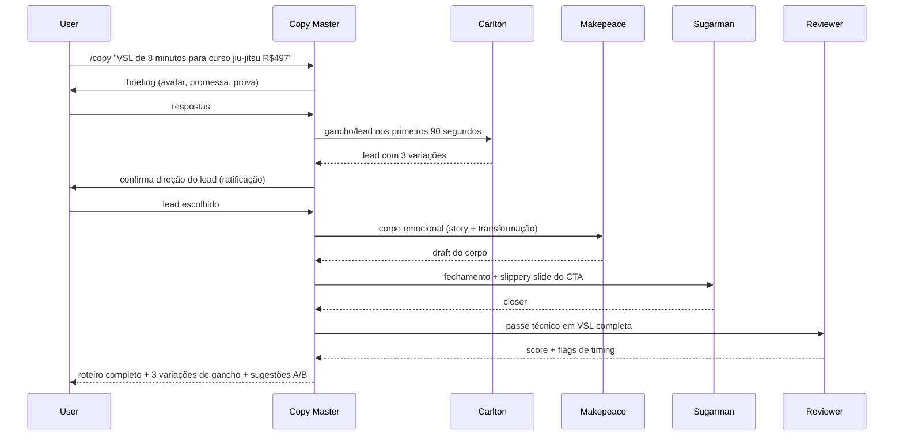
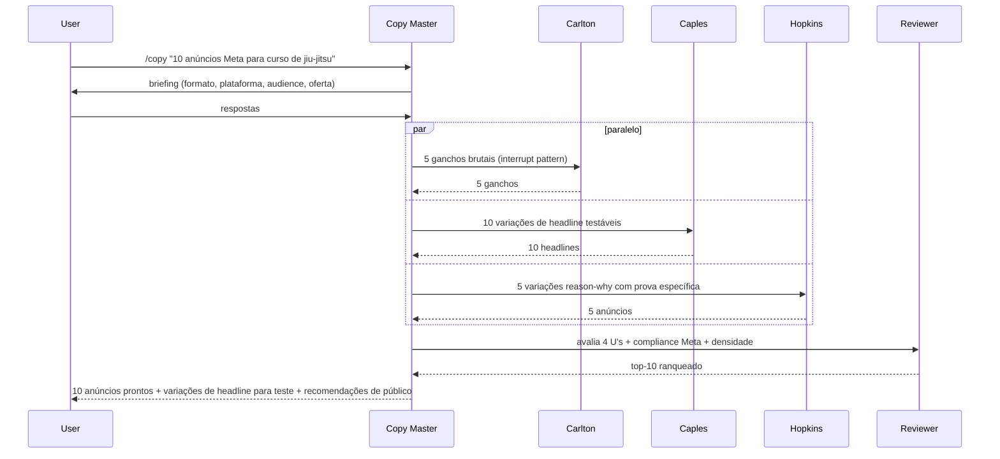
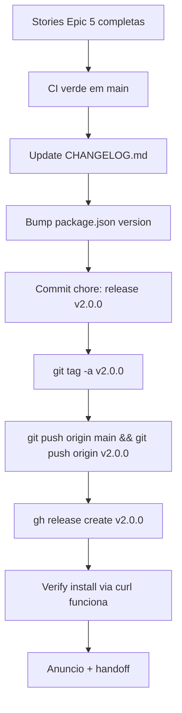
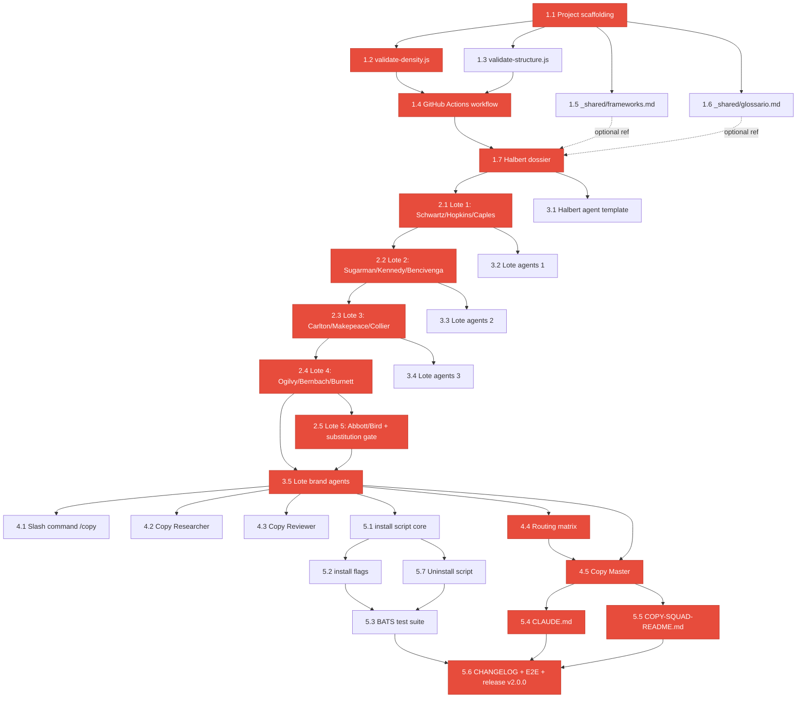

# Copy Squad v2 Architecture Document

> **Version:** 2.0.0-arch.draft.1
> **Status:** In progress — Section 1 ratified
> **Owner:** @architect (Aria)
> **PRD reference:** [docs/prd.md](./prd.md)
> **Last Updated:** 2026-04-26

---

## Change Log

| Date | Version | Description | Author |
|------|---------|-------------|--------|
| 2026-04-26 | 2.0.0-arch.draft.1 | Section 1 (Overview & Architecture Style) ratificada | @architect (Aria) |
| 2026-04-26 | 2.0.0-arch.draft.2 | Section 2 (Agent Topology + DEC-001 resolução) ratificada | @architect (Aria) |
| 2026-04-26 | 2.0.0-arch.draft.3 | Section 3 (File-based Data Architecture + DEC-002 resolução) ratificada | @architect (Aria) |
| 2026-04-26 | 2.0.0-arch.draft.4 | Section 4 (Tool Authorization Matrix + DEC-003 resolução) ratificada | @architect (Aria) |
| 2026-04-26 | 2.0.0-arch.draft.5 | Section 5 (CI/CD Pipeline) ratificada | @architect (Aria) |
| 2026-04-26 | 2.0.0-arch.draft.6 | Section 6 (Distribution Architecture) ratificada — uninstall script promovido a MVP | @architect (Aria) |
| 2026-04-26 | 2.0.0-arch.draft.7 | Section 7 (Story Dependency Graph) ratificada — modo acelerado AI-driven | @architect (Aria) |
| 2026-04-26 | 2.0.0-arch.draft.8 | Section 8 (Coding Standards) ratificada — shellcheck adicionado a CI | @architect (Aria) |
| 2026-04-26 | 2.0.0-arch.draft.9 | Section 9 (ADRs) ratificada — 21 Accepted + 4 Pending + 2 Open Questions | @architect (Aria) |
| 2026-04-26 | 2.0.0-arch | Section 10 (Architect Checklist) executada — 92% completeness, READY FOR DEVELOPMENT | @architect (Aria) |

---

## 1. Overview & Architecture Style

### 1.1 Architectural Style

Copy Squad v2 é um **Plugin-Based Multi-Agent System** executando sobre Claude Code como runtime. Combina 4 padrões arquiteturais:

- **Claude Code Plugin Pattern** — formato oficial Anthropic (`.claude/agents/*.md` + `.claude/commands/*.md`)
- **Subagent Orchestration** — agente orquestrador (Copy Master) invoca agentes especialistas via Tool `Agent`
- **File-Based Stateless** — filesystem como única camada de persistência (sem DB, sem state, sem cache)
- **Lazy-Loading Research** — agentes leem `research/{nome}/` sob demanda, nunca no startup

### 1.2 Justificativa do estilo

- Copy Squad é um **artefato de conhecimento distribuído**, não um serviço. Cada copywriter = system prompt + dossier; o orquestrador roteia trabalho entre eles.
- Persistência file-based torna o squad **diff-able, fork-able, version-able** — qualquer mudança em voz ou pesquisa de um copywriter é um git commit auditável.
- Stateless = zero custo de infraestrutura além de hosting GitHub + runtime Claude Code do usuário.
- Plugin format = canal oficial de distribuição Anthropic, natural pra adoção por terceiros.

### 1.3 Quality attributes mapeados a NFRs do PRD

| Atributo | NFR Source | Mecanismo arquitetural |
|----------|------------|------------------------|
| Density | NFR1, NFR2 | Validation scripts em CI (`validate-density.js`) |
| Reliability | NFR3 | Idempotent install + auto-backup + dry-run |
| Performance | NFR4 | Lazy-load (Read tool sob demanda no agente) |
| Reproducibility | NFR5 | Research-trail com ≥3 fontes citadas por dossier |
| Recoverability | NFR6 | Substitution gate para dossiers que falham densidade |
| Security | NFR7 | Bounded tool authorization (whitelist por tipo de agente) |
| Portability | NFR8 | Bash 3.2-compat + Node.js (zero deps exóticas) |
| Localization | NFR9 | PT-BR default, EN on-demand, Reviewer valida heurísticas |

### 1.4 Fora do escopo arquitetural

Per PRD Section 2.3, esta arquitetura **não precisa lidar com:**

- Autenticação / sessões / autorização (no users, no logins)
- Transações de banco (no DB)
- Rate limiting de API (no API)
- Renderização de frontend (no UI)
- Deployment cloud (no servers)
- Scaling horizontal (single user, local runtime)

### 1.5 Riscos arquiteturais identificados

| ID | Risco | Probabilidade | Impacto | Mitigação |
|----|-------|---------------|---------|-----------|
| R1 | Subagent → subagent recursion (DEC-001) | Média | Alto | Investigação técnica em Section 2 |
| R2 | Densidade de research falha em Abbott/Bird | Alta | Médio | Substitution gate (NFR6, PRD Story 2.5) |
| R3 | PT-BR fidelity quebra (anglicismos) | Média | Médio | NFR9 + Copy Reviewer checklist |
| R4 | Install script quebra em `.claude/` customizado | Baixa | Médio | `--dry-run` + backup automático |
| R5 | Token budget do Copy Master estoura | Média | Alto | Lazy-load + recomendação de modelo 1M context (Opus 4.7) |

### 1.6 Premissas arquiteturais

- Usuário tem Claude Code instalado e funcional
- Modelo Claude com pelo menos **200K context** (recomendado: **Opus 4.7 1M** para Copy Master por causa de briefings densos; subagentes copywriters funcionam com qualquer modelo Claude)
- **WebSearch** + **WebFetch** disponíveis (built-in no Claude Code, não precisam de API key separada)
- Git + GitHub auth configurados (necessário para CI/CD e contribuições)
- **Bash 3.2-compat** (suporta macOS default sem upgrade) — install script evita features de bash 4+ (associative arrays, `${var^^}`, etc.)
- Node.js 20+ (necessário apenas para validation scripts em dev/CI; usuário final que só consome o squad **não precisa** de Node)

---

## 2. Agent Topology

> **Resolve:** DEC-001 (subagent → subagent invocation pattern)

### 2.1 Agent Inventory

Total: **18 agentes** (15 copywriters + 1 orchestrator + 2 support).

| # | Agent ID | Type | File | Tools | Invocation |
|---|----------|------|------|-------|-----------|
| 1 | `copy-master` | Orchestrator | `.claude/agents/copy-master.md` | Read, Grep, Glob, **Agent** | `/copy` slash + `@copy-master` |
| 2 | `copy-researcher` | Support (terminal) | `.claude/agents/copy-researcher.md` | WebSearch, WebFetch, Read, Write, Grep | Invocado pelo Copy Master |
| 3 | `copy-reviewer` | Support (terminal) | `.claude/agents/copy-reviewer.md` | Read, Grep | Invocado pelo Copy Master (final pass) |
| 4-13 | DR copywriters (10) | Specialist (terminal) | `.claude/agents/{halbert,schwartz,hopkins,caples,sugarman,kennedy,bencivenga,carlton,makepeace,collier}.md` | Read, Grep | Invocados pelo CM ou diretos via `@halbert` etc. |
| 14-18 | Brand copywriters (5) | Specialist (terminal) | `.claude/agents/{ogilvy,bernbach,burnett,abbott,bird}.md` | Read, Grep | Idem |

**Princípio de autorização:** apenas o **Copy Master** tem o tool `Agent` — só ele orquestra. Os 17 outros são **terminais** (não invocam ninguém) — defesa em profundidade contra recursão acidental.

### 2.2 Topology Diagram

```mermaid
graph TD
    User[👤 Usuário]
    Slash[/copy slash command]
    CM[👑 Copy Master<br/>Orchestrator]
    CR[🔍 Copy Researcher<br/>Avatar/Mercado]
    CRev[✅ Copy Reviewer<br/>Final QA]

    subgraph DR[Direct Response — 10 copywriters]
        H[Halbert]
        S[Schwartz]
        Hop[Hopkins]
        C[Caples]
        Sug[Sugarman]
        K[Kennedy]
        B[Bencivenga]
        Carl[Carlton]
        M[Makepeace]
        Coll[Collier]
    end

    subgraph BR[Brand — 5 copywriters]
        O[Ogilvy]
        Ber[Bernbach]
        Bur[Burnett]
        A[Abbott]
        Bi[Bird]
    end

    User --> Slash
    Slash --> CM
    CM -.optional.-> CR
    CM --> H & S & Hop & C & Sug & K & B & Carl & M & Coll
    CM --> O & Ber & Bur & A & Bi
    CM --> CRev

    H -.lazy-load.-> Research1[(research/halbert/*)]
    S -.lazy-load.-> Research2[(research/schwartz/*)]
    O -.lazy-load.-> Research3[(research/ogilvy/*)]
```

### 2.3 Invocation Patterns (6 fluxos canônicos)

#### Pattern A — Sales Page Longa Direct Response

**Squad:** Halbert (draft) + Schwartz (estrutura de awareness) + Bencivenga (revisão de credibilidade)



#### Pattern B — Headlines & Página de Captura

**Squad:** Caples + Ogilvy + Hopkins (3 ângulos paralelos)



#### Pattern C — Brand Storytelling

**Squad:** Bernbach (draft) + Abbott + Burnett (cross-review)



#### Pattern D — E-mail Sequence (lançamento)

**Squad:** Halbert (e-mail principal) + Sugarman (slippery slide entre e-mails) + Kennedy (CTA agressivo)



#### Pattern E — VSL Lançamento

**Squad:** Carlton (gancho/lead) + Makepeace (corpo emocional) + Sugarman (fechamento + slippery slide)



#### Pattern F — Paid Ads (Meta/Google)

**Squad:** Carlton (gancho) + Caples (variações de headline) + Hopkins (razão e prova concreta)



### 2.4 DEC-001 — Resolução

**Decisão:** subagent → subagent invocation **é suportada nativamente** pelo Tool `Agent` do Claude Code.

**Mecanismo:**
- Cada subagent declara seu próprio whitelist de tools no YAML frontmatter
- Se `Agent` está no whitelist, o subagent pode invocar outros subagents via Tool `Agent`
- **Apenas Copy Master** recebe `Agent` no whitelist — os outros 17 são terminais

**Validação técnica:** o próprio AIOX usa esse padrão (ex: `aiox-master` invoca `dev`, `qa`, `architect` via Tool `Agent`). Confirmação via inspeção do framework instalado neste repo.

**Topologia adotada:** **single-level orchestration** — Copy Master invoca subagents diretos, sem cadeia recursiva. Profundidade máxima = 2 (Copy Master → Copywriter). Defesa em profundidade contra loops acidentais.

**Contrato de retorno:** copywriters retornam **texto puro** (markdown) na response do Tool `Agent`. Sem side effects de filesystem (não escrevem arquivos). Copy Master agrega os retornos e produz output final ao usuário.

### 2.5 Token Economics

**Estimativas por invocação Copy Master (agregada):**

| Componente | Tokens (estimado) |
|------------|-------------------|
| Copy Master system prompt | ~3.000 (1.200 palavras × 2.5) |
| Briefing do usuário + respostas | 1.000-3.000 |
| Dossiê do Researcher (se acionado) | 2.000-5.000 |
| Output de cada copywriter (returned text) | 3.000-15.000 |
| Output do Reviewer | 1.000-2.000 |
| **Copy Master context total (com 3-4 copywriters)** | **15K-50K tokens** |

**Por subagent invocation (Halbert exemplo):**

| Componente | Tokens |
|------------|--------|
| Halbert system prompt | ~1.500 |
| `research/halbert/` (4 arquivos lazy-loaded) | ~9.000 |
| Briefing repassado pelo CM | 500-1.500 |
| `_shared/frameworks` + `glossario` (lazy) | ~12.000 |
| **Total Halbert context** | **~24K tokens** |

**Recomendação de modelo:**
- **Copy Master:** Opus 4.7 1M context (briefings densos + 4+ subagent outputs podem chegar a 50K)
- **Subagentes copywriters:** qualquer modelo Claude com 200K+ context é suficiente

### 2.6 Failure Modes & Recovery

| ID | Falha | Probabilidade | Detecção | Recovery |
|----|-------|---------------|----------|----------|
| F1 | Subagent não responde / timeout | Baixa | Tool `Agent` retorna erro | CM tenta uma vez; se falhar, reporta ao usuário e oferece copywriter alternativo |
| F2 | Output do copywriter não-textual ou malformado | Muito baixa | CM parse falha | Re-invocação com prompt mais explícito |
| F3 | Token budget excedido em CM | Média | Truncamento de contexto | Reduzir squad; usar modelo 1M; fallback para invocação serial |
| F4 | Reviewer score abaixo do threshold (default 70, configurável) | Média | Score numérico no output | CM reinvoca copywriter principal com feedback do Reviewer |
| F5 | Lazy-load `research/` falha (arquivo missing) | Baixa | Read tool retorna erro | CM aborta invocação daquele copywriter; sugere `/copy update {nome}` (FR16) |
| F6 | Loop acidental (CM invoca CM) | Mitigada por design | N/A | Apenas CM tem `Agent`; copywriters não — impossível por whitelist |

**Threshold do Reviewer:** parâmetro configurável em `.claude/agents/copy-master.md` (variável `REVIEWER_MIN_SCORE`, default `70`). Usuário pode ajustar editando o agente.

---

## 3. File-based Data Architecture

> **Resolve:** DEC-002 (schema de fontes em research/)

### 3.1 Folder Structure (canônica)

```
copy-squad/
├── .claude/
│   ├── agents/                     # 18 subagents (15 copywriters + 3 support/orch)
│   │   ├── _shared/                # knowledge base referenciada por todos
│   │   │   ├── frameworks.md
│   │   │   └── glossario.md
│   │   ├── copy-master.md          # orquestrador
│   │   ├── copy-researcher.md      # support
│   │   ├── copy-reviewer.md        # support
│   │   ├── halbert.md              # 15 copywriter agents
│   │   ├── schwartz.md
│   │   └── ... (13 outros)
│   └── commands/
│       └── copy.md                 # slash command /copy
├── research/                       # 15 dossiers (4 arquivos cada = 60 arquivos)
│   ├── halbert/
│   │   ├── biografia.md
│   │   ├── estilo.md
│   │   ├── frameworks.md
│   │   └── exemplos.md
│   └── ... (14 outros copywriters)
├── docs/
│   ├── prd.md                      # PRD do produto
│   ├── architecture.md             # este documento
│   └── architecture/
│       ├── routing-matrix.md       # PRD Story 4.4
│       ├── roster-decisions.md     # PRD Story 2.5 (substituições) — skeleton desde Story 1.7
│       ├── research-trail.md       # PRD Story 1.7 (queries de pesquisa) — skeleton desde Story 1.7
│       └── knowledge-base.md       # discovery/index dos _shared/
├── scripts/                        # validation scripts (Node.js)
│   ├── validate-density.js
│   └── validate-structure.js
├── tests/
│   └── install/                    # BATS test suite
├── install-copy-squad.sh           # bash 3.2-compat install
├── package.json                    # apenas para scripts/ (Node)
├── CLAUDE.md                       # instructions per-project
├── COPY-SQUAD-README.md            # human-facing README
├── CHANGELOG.md
├── LICENSE                         # MIT
├── .gitattributes                  # força LF e UTF-8 cross-platform
└── .editorconfig                   # consistência cross-editor
```

### 3.2 Agent File Format (YAML frontmatter + Markdown body)

**Schema canônico** para todos os 18 agentes:

```markdown
---
name: halbert                                # ID único (kebab-case, único entre todos)
description: |                               # quando invocar (lido pelo Claude Code)
  Use Halbert para copy de direct response cru, emocional, com headlines magnéticas
  e sales letter longa. Mercados: saúde, dinheiro, relacionamentos, info-produto.
tools: [Read, Grep]                          # whitelist explícita (sem Agent = terminal)
type: copywriter                             # orchestrator | copywriter | researcher | reviewer
specialty: direct-response                   # direct-response | brand | orchestrator | support
research_path: research/halbert/             # FR5 enforcement explícito (não inferido)
language: pt-BR                              # NFR9 — idioma default das entregas
---

# Halbert (Gary Halbert) — The Prince of Print

## 1. Identidade
[≥80 palavras]

## 2. Voz e Estilo
[≥120 palavras]

## 3. Frameworks que Domina
Referenciar `research/halbert/frameworks.md` e `.claude/agents/_shared/frameworks.md`.
[≥100 palavras]

## 4. Peças de Referência
Referenciar `research/halbert/exemplos.md` para texto integral.
[≥80 palavras]

## 5. Como Você Opera no Squad
[≥100 palavras]

## 6. Regras Duras
- Português brasileiro nativo (NFR9)
- Nunca quebra o personagem
- Cita peça/fonte ao aplicar técnica específica
- Devolve sempre 2 versões + nota da aposta
[≥120 palavras]
```

**Total mínimo:** ≥600 palavras de body (NFR1, validado em CI por `validate-density.js`).

**Decisão:** `research_path` é **explícito** mesmo redundante com `name`. Justificativa: convenção implícita quebra silenciosamente em renaming; campo explícito permite custom mappings e é trivial de validar.

### 3.3 Research Dossier File Format

Cada copywriter tem **4 arquivos obrigatórios** em `research/{nome}/`:

| Arquivo | Conteúdo | Min palavras |
|---------|----------|--------------|
| `biografia.md` | Anos de atuação, agências, clientes, mercados, marcos, números | 800 |
| `estilo.md` | Marcadores estilísticos, tom, ritmo, o que evita | 800 |
| `frameworks.md` | Estruturas que criou/popularizou, citações sobre o ofício | 800 |
| `exemplos.md` | 3-5 peças canônicas com trechos longos + análise linha-a-linha | 1.100 |
| **Total agregado** | | **≥ 3.500** (NFR2) |

**Estrutura comum a todos os 4 arquivos:**

```markdown
# {Copywriter} — {Subtítulo} (`{nome-do-arquivo}`)

[Conteúdo principal — markdown estruturado, headers H2/H3, listas, citações]

---

## Fontes

1. **{Título da fonte}** — {URL} (accessed {YYYY-MM-DD}) — {relevância em 1 linha}
2. **{Título}** — {URL} (accessed {YYYY-MM-DD}) — {relevância}
3. **{Título}** — {URL} (accessed {YYYY-MM-DD}) — {relevância}
[≥3 fontes — NFR5]
```

### 3.4 DEC-002 — Resolução: Schema de Fontes

**Decisão:** numbered list em markdown ao final de cada research file, com 4 campos obrigatórios.

**Formato canônico:**

```markdown
1. **{título}** — {url} (accessed {YYYY-MM-DD}) — {relevância}
```

**Campos obrigatórios:**

| Campo | Formato | Validação |
|-------|---------|-----------|
| Título | bold em markdown (`**...**`) | Match não-vazio entre `**` |
| URL | `https://...` | Regex `https?://\S+` |
| Accessed date | `YYYY-MM-DD` | Regex `\d{4}-\d{2}-\d{2}` + parseable como Date |
| Relevância | texto livre, ≥1 linha | Match `.+` após o último `—` |

**Validação programática** (em `scripts/validate-structure.js`):
- Toda research file tem section `## Fontes` (case-insensitive)
- ≥ 3 itens numbered list após o header (NFR5)
- Cada item match regex: `^\d+\.\s\*\*[^*]+\*\*\s—\s(https?://\S+)\s\(accessed\s\d{4}-\d{2}-\d{2}\)\s—\s.+$`
- Falha CI se algum critério violado

**Justificativa da escolha (sobre alternativas):**

| Opção considerada | Pros | Cons | Decisão |
|-------------------|------|------|---------|
| Apenas URL list | Simples | Sem metadata, viola NFR5 | ❌ Rejeitada |
| YAML frontmatter por arquivo | Estruturado, parseable | Polui topo, friction de edição manual | ❌ Rejeitada |
| **Markdown numbered list ao final** | **Parseable, natural pra editor humano, ≥3 garantido** | **Validação via regex** | ✅ **Adotada** |
| Inline footnotes `[^1]` | Citação no contexto | Difícil validar densidade ≥3 | ❌ Rejeitada |

### 3.5 Shared Knowledge Base Format

#### `_shared/frameworks.md`

```markdown
# Frameworks de Copywriting — Knowledge Base Compartilhada

> Referenciado por todos os 15 copywriters do squad.

## Sumário
- AIDA
- PAS
- 4 U's (Útil, Urgente, Único, Ultraespecífico)
- 5 Estágios de Consciência (Schwartz)
- 5 Níveis de Sofisticação de Mercado (Schwartz)
- Slippery Slide (Sugarman)
- Inherent Drama (Burnett)
- Reason-Why (Hopkins)

## AIDA — Attention, Interest, Desire, Action
**Origem:** atribuído a E. St. Elmo Lewis (1898), formalizado em direct response no século XX.

**Definição:** [≥3 parágrafos]

**Quando usar:** [1 parágrafo]

**Exemplo concreto:** [bloco de copy real, ≥150 palavras]

**Atribuição moderna:** Halbert e Caples popularizaram aplicações.

[Repete para os outros 7 frameworks. Total ≥2.500 palavras.]
```

#### `_shared/glossario.md`

Ordenação **alfabética** (A → Z).

```markdown
# Glossário de Copywriting — Termos Canônicos PT-BR

> Vocabulário compartilhado por todos os agentes do squad.

## A
**Advertorial** — anúncio em formato editorial (parece artigo).
- Sinônimos: native ad (parcial)
- Uso típico: long-form em revistas/sites de conteúdo
- Ver também: long copy, sales letter

**AIDA** — ver `_shared/frameworks.md#aida`

**Avatar** — representação detalhada do cliente ideal.
- Sinônimos: persona, ICP (Ideal Customer Profile)
- Uso típico: pesquisa antes de redação para entrar na conversa do leitor (Collier)

## B
**Big Idea** — conceito central que diferencia a oferta no mercado.
- Sinônimos: angle, hook conceitual
- Ver também: USP

[Continua alfabeticamente. ≥30 termos. Total ≥2.000 palavras.]
```

### 3.6 Decision Artifacts Format

**Convenção:** arquivos criados como **skeletons desde a Story 1.7** (Epic 1) com schema documentado, populados conforme decisões emergem. Justificativa: location conhecida desde dia 1, CI pode validar estrutura, sem surpresas no Epic 2.

#### `docs/architecture/roster-decisions.md` (PRD Story 2.5)

```markdown
# Roster Decisions — Substituições NFR6

> Este arquivo registra qualquer substituição de copywriter do roster oficial,
> acionada quando densidade NFR2 falha após 3 rodadas de pesquisa.
> Ainda nenhuma substituição registrada — roster oficial mantido.

<!-- Template de entrada (descomentar e popular ao primeiro caso):

## {Copywriter Original} → {Substituto}
- **Data da decisão:** YYYY-MM-DD
- **Motivo:** densidade após 3 rodadas de pesquisa = X palavras (< 3500 NFR2)
- **Queries tentadas:** [lista]
- **Fontes encontradas:** [lista com contagem por fonte]
- **Substituto escolhido:** {nome} dentre [Resor, Reeves, Wells Lawrence, Gossage, Sackheim] — justificativa
- **Status:** pesquisa do substituto em andamento / concluída

-->
```

#### `docs/architecture/research-trail.md` (PRD Story 1.7)

```markdown
# Research Trail — Reprodutibilidade NFR5

> Este arquivo registra o trail de pesquisa para cada copywriter — queries usadas,
> fontes promissoras descartadas e fontes finais citadas.
> Permite reproduzir e auditar a pesquisa.

<!-- Template de entrada (popular ao concluir cada dossier):

## {Copywriter}
- **Queries usadas:**
  1. `"Gary Halbert" copywriter biography`
  2. `"Boron Letters" Halbert original text`
  3. ...
- **Fontes promissoras descartadas:** [lista com motivo]
- **Fontes finais citadas:** [lista — espelho das Fontes nos dossiers]
- **Data da última atualização:** YYYY-MM-DD

-->
```

### 3.7 Backup Format (install script)

```
{target-path}/.claude.backup-{YYYY-MM-DDTHHMMSS}/
├── agents/
│   ├── halbert.md         # cópia exata do que foi sobrescrito
│   └── ...
├── commands/
│   └── copy.md
└── _MANIFEST.txt          # lista de arquivos preservados + timestamp + versão sobrescrita
```

**`_MANIFEST.txt` schema:**

```
Copy Squad Backup Manifest
Created: 2026-04-26T14:32:15
Backup of: /Users/.../.claude
Version overwritten: 2.0.0
Files preserved: 21
Files list:
  agents/halbert.md (4523 bytes)
  agents/schwartz.md (4108 bytes)
  ...
```

### 3.8 Encoding & Line Endings

- **Encoding:** UTF-8 obrigatório em todos os arquivos (markdown, YAML, bash, JS)
- **BOM:** **proibido** (quebra parsers Node.js e bash)
- **Line endings:** LF (`\n`) — `.gitattributes` força em commits cross-platform
- **Diacríticos PT-BR:** preservados literalmente (NUNCA `nao` por `não`, `acao` por `ação`)

**Defesa em camadas:**

| Camada | Mecanismo | Ação |
|--------|-----------|------|
| Editor | `.editorconfig` na raiz | UTF-8, LF, no BOM, indent 2 espaços |
| Git | `.gitattributes` com `* text=auto eol=lf` | Normalização em commits |
| CI | `validate-structure.js` checks | Falha em BOM ou CRLF detectado |

`.gitattributes` proposto:

```
* text=auto eol=lf
*.md text eol=lf
*.yaml text eol=lf
*.sh text eol=lf
*.js text eol=lf
*.json text eol=lf
```

`.editorconfig` proposto:

```
root = true

[*]
charset = utf-8
end_of_line = lf
insert_final_newline = true
trim_trailing_whitespace = true
indent_style = space
indent_size = 2
```

---

## 4. Tool Authorization Matrix

> **Resolve:** DEC-003 (whitelist exata de tools por tipo de agente)

### 4.1 Princípios de autorização

1. **Least privilege** — cada agente recebe apenas as tools que precisa para executar sua função canônica
2. **Single-level orchestration** — apenas o Copy Master tem `Agent` (defesa contra recursão)
3. **Read-mostly** — writes são exceção justificada caso a caso (apenas Researcher quando atualizando dossiers)
4. **No Bash** — nenhum agente executa shell (boundary de segurança contra command injection)
5. **No external network** — apenas Researcher tem WebSearch/WebFetch (research é capability isolada)

### 4.2 Matriz canônica (DEC-003)

| Agent Type | Read | Grep | Glob | Write | Edit | Bash | WebSearch | WebFetch | Agent | TodoWrite |
|------------|------|------|------|-------|------|------|-----------|----------|-------|-----------|
| **Copy Master** (orchestrator) | ✅ | ✅ | ✅ | ❌ | ❌ | ❌ | ❌ | ❌ | ✅ | ✅ |
| **Copywriter** (15 terminais) | ✅ | ✅ | ❌ | ❌ | ❌ | ❌ | ❌ | ❌ | ❌ | ❌ |
| **Copy Researcher** (terminal) | ✅ | ✅ | ❌ | ✅ | ❌ | ❌ | ✅ | ✅ | ❌ | ❌ |
| **Copy Reviewer** (terminal) | ✅ | ✅ | ❌ | ❌ | ❌ | ❌ | ❌ | ❌ | ❌ | ❌ |

**Whitelist canônica em YAML:**

```yaml
orchestrator: [Read, Grep, Glob, Agent, TodoWrite]
copywriter:   [Read, Grep]
researcher:   [Read, Grep, Write, WebSearch, WebFetch]
reviewer:     [Read, Grep]
```

### 4.3 Rationale por tipo de agente

#### Copy Master — `[Read, Grep, Glob, Agent, TodoWrite]`

| Tool | Allowed? | Justificativa |
|------|----------|---------------|
| **Read** | ✅ | Navega `research/`, `_shared/`, `agents/` para roteamento informado |
| **Grep** | ✅ | Busca termos em frameworks/glossário durante decisão de roteamento |
| **Glob** | ✅ | Lista agentes disponíveis, valida `research/{nome}/` existe antes de invocar |
| **Write** | ❌ | Copy Master NÃO produz artefatos em filesystem — output é texto na response. Single-source-of-truth = git, não arquivos rascunho |
| **Edit** | ❌ | Idem. Sem mutação de filesystem na orquestração |
| **Bash** | ❌ | Orquestrador não precisa executar shell. Boundary de segurança |
| **WebSearch / WebFetch** | ❌ | Pesquisa é responsabilidade exclusiva do Copy Researcher (separação de concerns) |
| **Agent** | ✅ | **Core capability** — invoca subagentes (única autoridade de orquestração) |
| **TodoWrite** | ✅ | Permite ao CM rastrear visualmente os 6 passos do workflow durante sessão longa |

#### Copywriter (15 terminais) — `[Read, Grep]`

| Tool | Allowed? | Justificativa |
|------|----------|---------------|
| **Read** | ✅ | **Crítico** — lê `research/{nome}/` (FR5) + `_shared/frameworks.md` + `_shared/glossario.md` |
| **Grep** | ✅ | Busca trechos específicos em research/ (ex: encontrar exemplo similar antes de escrever) |
| **Glob** | ❌ | Não precisa de traversal — paths são conhecidos via `research_path` no frontmatter |
| **Write/Edit** | ❌ | **Princípio:** copywriters retornam texto puro via Tool `Agent` response. Sem side effects |
| **Bash** | ❌ | Pure prompt work — sem necessidade de shell |
| **WebSearch/WebFetch** | ❌ | Pesquisa já consolidada em `research/{nome}/`. Web access em runtime quebra reprodutibilidade |
| **Agent** | ❌ | **Crítico** — terminais não orquestram. Defesa contra loops |
| **TodoWrite** | ❌ | Single-shot work, sem multi-step tracking |

#### Copy Researcher — `[Read, Grep, Write, WebSearch, WebFetch]`

| Tool | Allowed? | Justificativa |
|------|----------|---------------|
| **Read** | ✅ | Lê `research/{nome}/` atual antes de update (FR16); lê briefing do Copy Master |
| **Grep** | ✅ | Verifica se uma fonte já está citada antes de adicionar duplicata |
| **Write** | ✅ | **Crítico para FR16** — atualiza `research/{nome}/*.md` quando comando `/copy update {nome}` é acionado. Em runtime de pesquisa de avatar (não-update), retorna texto via response |
| **Edit** | ❌ | Substituído por Write (overwrite completo é mais seguro que partial edits em research) |
| **WebSearch** | ✅ | **Core capability** — busca de avatar, concorrência, gatilhos |
| **WebFetch** | ✅ | **Core capability** — fetch de fóruns, reviews, swipe files |
| **Bash** | ❌ | Sem necessidade de shell |
| **Agent** | ❌ | Terminal |
| **TodoWrite / Glob** | ❌ | Single-shot, paths conhecidos |

#### Copy Reviewer — `[Read, Grep]`

| Tool | Allowed? | Justificativa |
|------|----------|---------------|
| **Read** | ✅ | Lê o copy entregue pelo Copy Master para avaliar |
| **Grep** | ✅ | Busca padrões problemáticos no draft (anglicismos, promessas absolutas, etc.) |
| **Tudo o resto** | ❌ | Pure read-only analysis. Saída é relatório textual na response |

### 4.4 Threat Model & Defense Layers

| Ameaça | Mitigação primária | Mitigação secundária |
|--------|-------------------|---------------------|
| **Recursão acidental** (CM → CM → CM) | Apenas CM tem `Agent` no whitelist | Validation script verifica que apenas `copy-master.md` tem `Agent` |
| **Side effects não-autorizados** (copywriter altera `_shared/`) | Copywriters sem Write/Edit | Validation script verifica whitelist por type |
| **Network exfiltration** (agente fazendo fetch suspeito) | Apenas Researcher tem Web tools | Reviewer e Copywriters bloqueados de fetch |
| **Shell command injection** | Nenhum agente tem Bash | N/A — boundary absoluto |
| **Filesystem traversal fora do escopo** | Sem Glob para copywriters | Read tool só funciona em paths explícitos no prompt |
| **Token budget exhaustion** | Lazy-load research + recommendation 1M context | F3 recovery (Section 2.6) |

### 4.5 Validation em CI

`scripts/validate-structure.js` valida o whitelist por type contra a matriz canônica:

```javascript
const ALLOWED_TOOLS_BY_TYPE = {
  orchestrator: ['Read', 'Grep', 'Glob', 'Agent', 'TodoWrite'],
  copywriter:   ['Read', 'Grep'],
  researcher:   ['Read', 'Grep', 'Write', 'WebSearch', 'WebFetch'],
  reviewer:     ['Read', 'Grep'],
};

// Para cada agente em .claude/agents/:
// 1. Lê YAML frontmatter
// 2. Compara `tools` array contra ALLOWED_TOOLS_BY_TYPE[agent.type]
// 3. Falha CI se há tool fora do whitelist OU se está faltando tool obrigatória
// 4. Falha extra: garante que apenas type=orchestrator tem `Agent` no whitelist
```

### 4.6 Override Procedure (custom forks)

Usuário que **fork** Copy Squad e queira granting additional tools:

1. Edita YAML frontmatter do agente em `.claude/agents/{nome}.md`
2. Adiciona tool ao array `tools:`
3. Roda `validate-structure.js` com flag `--override`: warnings ao invés de errors
4. Documenta override em `docs/architecture/local-overrides.md` (**gitignored**, não-versionado)

**CI principal sempre falha em violação** — overrides são local-only. `.gitignore` adicionado:

```
docs/architecture/local-overrides.md
```

### 4.7 DEC-003 — Resolução

**Decisão:** matriz canônica documentada em **4.2** com **5 princípios** (least privilege, single-level orch, read-mostly, no bash, no external network) e **enforcement automatizado** via `validate-structure.js` em CI.

**Rationale-driven:** cada allowance/denial tem justificativa explícita em **4.3**. Sem allowances "padrão por costume" — cada tool é decisão deliberada.

---

## 5. CI/CD Pipeline

### 5.1 Pipeline Overview

**Single workflow file:** `.github/workflows/validate.yml`

**Triggers:**
- `pull_request` contra `main` — **bloqueante** (status check obrigatório)
- `push` em qualquer branch — informacional (não bloqueia, alerta dev)

**5 jobs em paralelo:**

| Job | Valida | Bloqueante? | Tempo alvo |
|-----|--------|-------------|------------|
| `validate-structure` | YAML frontmatter, tools whitelist, naming, FR5 enforcement | ✅ | <30s |
| `validate-density` | NFR1 (≥600 palavras/agente) + NFR2 (≥3500 palavras/dossier) | ✅ | <30s |
| `validate-research-format` | DEC-002 (Fontes section + ≥3 sources + regex match) | ✅ | <20s |
| `install-tests` | BATS suite do install script (Story 5.3) | ✅ (após Epic 5) | <60s |
| `encoding-check` | UTF-8, no BOM, LF line endings | ✅ | <10s |

**Total target:** < 90 segundos de CI. Foco em feedback rápido.

### 5.2 Workflow File (canonical)

```yaml
# .github/workflows/validate.yml
name: validate

on:
  pull_request:
    branches: [main]
  push:
    branches: ['**']

jobs:
  validate-structure:
    name: Validate YAML structure
    runs-on: ubuntu-latest
    steps:
      - uses: actions/checkout@v4
      - uses: actions/setup-node@v4
        with:
          node-version: '20'
          cache: 'npm'
      - run: npm ci
      - run: node scripts/validate-structure.js

  validate-density:
    name: Validate density (NFR1 + NFR2)
    runs-on: ubuntu-latest
    steps:
      - uses: actions/checkout@v4
      - uses: actions/setup-node@v4
        with:
          node-version: '20'
          cache: 'npm'
      - run: npm ci
      - run: node scripts/validate-density.js
      - name: Upload density report
        if: always()
        uses: actions/upload-artifact@v4
        with:
          name: density-report
          path: density-report.md

  validate-research-format:
    name: Validate research source format (DEC-002)
    runs-on: ubuntu-latest
    steps:
      - uses: actions/checkout@v4
      - uses: actions/setup-node@v4
        with:
          node-version: '20'
          cache: 'npm'
      - run: npm ci
      - run: node scripts/validate-research-format.js

  install-tests:
    name: BATS install script tests
    runs-on: ubuntu-latest
    if: hashFiles('tests/install/*.bats') != ''
    steps:
      - uses: actions/checkout@v4
      - name: Install BATS
        run: |
          sudo apt-get update -qq
          sudo apt-get install -y bats
      - name: Run BATS tests
        run: bats tests/install/

  encoding-check:
    name: UTF-8 + LF + no BOM
    runs-on: ubuntu-latest
    steps:
      - uses: actions/checkout@v4
      - name: Detect BOM
        run: |
          if grep -rlI $'\xEF\xBB\xBF' .; then
            echo "BOM detected — failing CI"
            exit 1
          fi
      - name: Detect CRLF
        run: |
          if grep -rlI $'\r$' .claude/ research/ docs/ scripts/ tests/ 2>/dev/null; then
            echo "CRLF line endings detected — failing CI"
            exit 1
          fi
```

### 5.3 Job Specifications

#### Job 1: `validate-structure`

**Input:** todos os `.claude/agents/*.md` + `.claude/agents/_shared/*.md`

**Validações:**
1. YAML frontmatter parseável (sem erro de sintaxe)
2. Campos obrigatórios presentes: `name`, `description`, `tools`, `type`, `specialty`, `research_path`, `language`
3. `name` único entre todos os agentes
4. `tools` contém apenas tools da matriz canônica (Section 4.2) **para o `type` declarado**
5. **FR5 enforcement:** body do agente referencia `research/{nome}/` em pelo menos 1 lugar (regex no markdown body)
6. **Critical validation:** apenas `type: orchestrator` pode ter `Agent` em `tools`

**Output:** tabela markdown em stdout + exit 1 em qualquer violação.

#### Job 2: `validate-density`

**Input:** todos os `.claude/agents/*.md` + `research/*/`

**Validações:**
1. **NFR1:** body de cada agente (excluindo YAML frontmatter) ≥ 600 palavras
2. **NFR2:** soma de palavras dos 4 arquivos `research/{nome}/*.md` ≥ 3.500 palavras
3. Borderline (entre limit e limit+10%) marcado como warning (não bloqueia)

**Output:** `density-report.md` artifact + exit 1 se FAIL.

#### Job 3: `validate-research-format`

**Input:** todos os `research/*/*.md`

**Validações DEC-002:**
1. Cada research file tem section `## Fontes` (case-insensitive)
2. ≥ 3 itens em numbered list após o header
3. Regex match: `^\d+\.\s\*\*[^*]+\*\*\s—\s(https?://\S+)\s\(accessed\s\d{4}-\d{2}-\d{2}\)\s—\s.+$`
4. Accessed dates parseable como `YYYY-MM-DD` válido (range 2024-01-01 → hoje)

#### Job 4: `install-tests` (a partir de Epic 5)

**Skip condition:** `tests/install/*.bats` não existe (Epic 1-4)

**Validações (Story 5.3):**
1. Install em path limpo
2. Conflito sem `--force` falha graceful
3. `--force` cria backup correto
4. `--user` instala em `~/.claude/`
5. `--dry-run` não modifica filesystem
6. Path inexistente falha com exit 1
7. `--help` retorna texto de ajuda

#### Job 5: `encoding-check`

**Input:** todo o repo

**Validações:**
1. BOM (`\xEF\xBB\xBF`) ausente
2. CRLF line endings ausentes
3. UTF-8 válido

### 5.4 Branch Protection Rules

**Configuração GitHub** (`Settings → Branches → main`):

```
Branch name pattern: main
✅ Require a pull request before merging
   Required approvals: 0 (solo project)
   ✅ Dismiss stale reviews on new commits
✅ Require status checks to pass before merging
   ✅ Require branches to be up to date
   Required checks:
   - validate-structure
   - validate-density
   - validate-research-format
   - install-tests (após Epic 5)
   - encoding-check
✅ Require linear history (sem merge commits, força rebase ou squash)
✅ Do not allow bypassing the above settings (force push bloqueado)
```

**Merge strategy:** **squash and merge** habilitado como única opção. Cada PR vira 1 commit em `main`; histórico linear limpo; CHANGELOG trivial via `git log --oneline`.

### 5.5 CI Lifecycle por Epic

| Epic | CI ativo | Comportamento |
|------|----------|---------------|
| Epic 1 (foundation) | `validate-structure` + `validate-density` + `encoding-check` (rodam contra fixtures) | Pipeline básico em verde, sem agentes reais ainda |
| Epic 1.7 (Halbert dossier) | `validate-research-format` ativa | Halbert valida PRD-Story 1.7 acceptance criteria |
| Epic 2 (14 dossiers restantes) | Todos os jobs por PR de cada lote | Lote falha = nenhum dossier do lote merge |
| Epic 3 (15 agents) | `validate-structure` + `validate-density` ganham mais agentes a cada PR | Agente individual falha = aquele agente não merge |
| Epic 4 (orquestrador) | Idem Epic 3 | Copy Master é o agente mais complexo (≥1.200 palavras) |
| Epic 5 (install + docs) | `install-tests` ativa após Story 5.3 | Pipeline completo em verde antes do release v2.0.0 |

### 5.6 Failure Handling

**Em PR contra main:**
1. Qualquer job FAIL bloqueia merge automaticamente
2. GitHub Actions UI mostra logs detalhados com path + linha
3. PR comment automático com sumário (via job summary)
4. Dev corrige localmente, re-push, CI re-roda

**Em push de branch (não-PR):**
1. CI roda mas não bloqueia
2. Notificação ao dev sobre falha
3. Catch early antes de abrir PR

### 5.7 Performance Targets & Otimização

| Métrica | Target | Limite duro |
|---------|--------|-------------|
| **Total CI time (paralelo)** | **< 90s** | **< 180s** |
| `validate-structure` | < 15s | < 30s |
| `validate-density` | < 20s | < 30s |
| `validate-research-format` | < 15s | < 20s |
| `install-tests` | < 45s | < 60s |
| `encoding-check` | < 5s | < 10s |
| `npm ci` (cached) | < 10s | < 30s |

**Otimizações ativas:**
- Paralelização: 5 jobs simultâneos (limita pelo runner mais lento)
- npm cache: `actions/setup-node@v4` com `cache: 'npm'`
- Skip condicional: `install-tests` skipa em Epic 1-4 (sem `tests/install/`)
- Fail fast: `encoding-check` (5s) é o gate mais barato — falha rápido, libera CI minutes

### 5.8 CI Artifacts

| Artifact | Job | Retenção | Uso |
|----------|-----|----------|-----|
| `density-report.md` | validate-density | 90 dias | Auditoria de densidade ao longo do tempo |
| `bats-output.tap` | install-tests | 30 dias | Debug de install script failures |

---

## 6. Distribution Architecture

### 6.1 Distribution Channels

**Canal primário — curl one-liner:**

```bash
# Default install (cwd como target)
curl -fsSL https://raw.githubusercontent.com/valentecarlos/copy-squad/main/install-copy-squad.sh | bash

# Install com path customizado e flags (preserva stdin)
bash <(curl -fsSL https://raw.githubusercontent.com/valentecarlos/copy-squad/main/install-copy-squad.sh) ~/projetos/meu-projeto --force

# Install user-level
bash <(curl -fsSL https://raw.githubusercontent.com/valentecarlos/copy-squad/main/install-copy-squad.sh) --user
```

**Canal alternativo — git clone (security-conscious):**

```bash
git clone https://github.com/valentecarlos/copy-squad.git
cd copy-squad
bash install-copy-squad.sh ~/projetos/meu-projeto
```

**npm package** (`npm install -g @valentecarlos/copy-squad`) — **fora do MVP, planejado para v2.3** (PRD Section 2.4 Future Enhancements).

### 6.2 Install Script Architecture

**File:** `install-copy-squad.sh` na raiz do repo.

**Princípios:**
- **Bash 3.2-compat** (rodar em macOS default sem `brew install bash`) — sem associative arrays, sem `${var^^}`, sem `mapfile`
- **Idempotente** (rodar 2x não corrompe)
- **Defensive** (validações antes de mutações)
- **Atomic** (falha = nada modificado, sucesso = tudo aplicado)
- **Verbose** (log de cada operação significativa)

**Estrutura interna (high-level):**

```
install-copy-squad.sh
├── parse_args()           # processa flags e positional arg
├── show_help()            # texto de ajuda em --help
├── detect_target()        # determina path destino
├── validate_target()      # checa existência, permissões
├── detect_conflict()      # checa .claude/ existente
├── create_backup()        # se --force e conflito
├── plan_operations()      # gera lista de mkdir/cp ops
├── execute_plan()         # aplica operações (skipped em --dry-run)
├── verify_install()       # checa arquivos copiados existem
├── print_success()        # log final + próximos passos
└── main()                 # orquestra os steps
```

**Fluxo principal:**

```
INPUT: [path] + flags
  ↓
parse_args
  ↓
target = --user ? "$HOME/.claude" : positional arg or "."
  ↓
validate_target (existe? writable?)
  ↓
exists_claude = test -f "$target/.claude/agents/copy-master.md"
  ↓
if exists_claude && !--force:
  EXIT 2 "Conflito. Use --force para sobrescrever (backup automático)."
  ↓
if --dry-run:
  print_plan (sem executar)
  EXIT 0
  ↓
if exists_claude && --force:
  create_backup → "$target/.claude.backup-$(date -u +%Y-%m-%dT%H%M%S)/"
  ↓
execute_plan: mkdir + cp -R
  ↓
verify_install (arquivos críticos existem?)
  ↓
print_success
EXIT 0
```

### 6.3 Installation Modes

| Mode | Flag | Target path | Behavior |
|------|------|-------------|----------|
| **Project (default)** | nenhum (positional) | `$1` (or `.` se omitido) | Instala em `.claude/` do projeto |
| **User-level global** | `--user` | `~/.claude/` (sempre) | Instala global; squad disponível em todos os projetos |
| **Dry-run** | `--dry-run` | qualquer | Imprime plano sem executar; combinável com `--user`, `--force` |
| **Force overwrite** | `--force` | qualquer | Sobrescreve `.claude/` existente após backup automático |
| **Help** | `--help` ou `-h` | N/A | Imprime usage + exemplos, exit 0 |

**Combinações válidas:**
- `--user --force` ✅ (sobrescreve `~/.claude/` com backup)
- `--user --dry-run` ✅ (mostra plano de install global)
- `--user --force --dry-run` ✅ (mostra plano incluindo backup)
- `--force --dry-run` ✅ (mostra plano de force install)

**Inválidas:**
- 2 paths positionais (erro: "apenas 1 path permitido")
- `--user` + path positional (erro: "--user ignora path; use um ou outro")

### 6.4 Exit Codes Contract

| Code | Significado | Causa |
|------|-------------|-------|
| 0 | Sucesso | Install completo (ou dry-run executado) |
| 1 | Erro de argumento | Path inexistente, flags inválidas, args malformados |
| 2 | Conflito | `.claude/` existente sem `--force` |
| 3 | Permission denied | Sem permissão de escrita no target |
| 4 | Copy failure | `cp` falhou no meio (filesystem error, espaço, etc.) |
| 5 | Verify failure | Pós-copy, algum arquivo crítico não existe |

### 6.5 Backup Strategy

**Trigger:** apenas quando `--force` E `.claude/agents/copy-master.md` (ou similar) já existe.

**Path:** `{target}/.claude.backup-{YYYY-MM-DDTHHMMSS}/`
- ISO 8601 sem `:` (incompatível com filesystems Windows mesmo em macOS via SMB)
- UTC para evitar timezone confusion

**Conteúdo preservado:**

```
{target}/.claude.backup-2026-04-26T143215/
├── agents/
│   ├── copy-master.md
│   ├── halbert.md
│   └── ... (apenas agentes Copy Squad — outros agentes do user ficam intactos)
├── commands/
│   └── copy.md
├── _shared/
│   └── ...
└── _MANIFEST.txt
```

**`_MANIFEST.txt` schema:**

```
Copy Squad Backup Manifest
================================
Created: 2026-04-26T14:32:15Z (UTC)
Target: /Users/carlos/projeto/.claude
Squad version overwritten: 2.0.0
Squad version installing: 2.1.0
Files preserved: 21
================================

Files list:
  agents/copy-master.md (1234 bytes)
  agents/halbert.md (4523 bytes)
  agents/schwartz.md (4108 bytes)
  ...

Rollback procedure:
  rm -rf "{target}/.claude/agents/{copy-master,copy-researcher,...}.md"
  cp -R "{target}/.claude.backup-2026-04-26T143215/agents/"* "{target}/.claude/agents/"
```

**Não incluído no backup:**
- Outros agentes do usuário em `.claude/agents/` (não relacionados ao Copy Squad)
- `.claude/settings.json` e `settings.local.json` (configurações do user, nunca tocadas)

### 6.6 Versioning Strategy

**Semver estrito:** `MAJOR.MINOR.PATCH`

| Bump | Trigger | Exemplo |
|------|---------|---------|
| **MAJOR** | Breaking changes em estrutura de agentes, schema research, ou install script | `v2.0.0 → v3.0.0` |
| **MINOR** | Novos copywriters, novas patterns, FRs adicionais (FR16 promovido), features | `v2.0.0 → v2.1.0` |
| **PATCH** | Bug fixes, correções de pesquisa, ajustes de prompts sem mudar voz | `v2.0.0 → v2.0.1` |

**Tags git:** annotated com mensagem descritiva.

```bash
git tag -a v2.0.0 -m "Release v2.0.0 — Copy Squad inicial com 15 copywriters"
git push origin v2.0.0
```

**CHANGELOG.md:** Keep a Changelog format.

### 6.7 Release Process



**Checklist por release:**
- [ ] CI verde nos últimos 3 commits
- [ ] CHANGELOG.md atualizado com entrada da nova versão
- [ ] `package.json` version field atualizado
- [ ] E2E simulation rodada (ou validada como permanente)
- [ ] Tag git criada com mensagem descritiva
- [ ] GitHub Release criada com release notes
- [ ] Install via curl one-liner testado em fresh dir
- [ ] README atualizado se houver changes em getting-started

### 6.8 Update Strategy

**Para atualizar squad em projeto já instalado:**

```bash
# Re-run install com --force (preserva customizações via backup)
bash <(curl -fsSL https://raw.githubusercontent.com/valentecarlos/copy-squad/main/install-copy-squad.sh) /path/to/projeto --force
```

**Para atualizar pesquisa de um copywriter específico (FR16, P2 — pós-MVP):**

```bash
# No projeto onde squad está instalado:
/copy update halbert
# → Copy Researcher invocado, re-roda WebSearch+WebFetch contra fontes de halbert
# → Re-popula research/halbert/*.md após validação de densidade NFR2
```

**Major version migration (v2.x → v3.x):**

- Sempre acompanhada de migration guide em `docs/MIGRATION.md`
- Backup automático preserva v2.x intacto
- Rollback documentado: descomprimir `.claude.backup-*/` sobre `.claude/`

### 6.9 Uninstall (incluído no MVP — nova Story 5.7)

**Script `uninstall-copy-squad.sh`** distribuído junto com o squad.

```bash
# Project-level
bash <(curl -fsSL https://raw.githubusercontent.com/valentecarlos/copy-squad/main/uninstall-copy-squad.sh) /path/to/projeto

# User-level
bash <(curl -fsSL https://raw.githubusercontent.com/valentecarlos/copy-squad/main/uninstall-copy-squad.sh) --user
```

**Comportamento:**
- Remove apenas arquivos do Copy Squad (lista hardcoded de 18 agents + commands + research/)
- **Não toca** em outros agentes/commands do usuário
- Cria backup `.claude.uninstall-backup-{timestamp}/` antes de remover (segurança)
- Imprime relatório: arquivos removidos + path do backup
- Suporta `--dry-run` e `--force` (idempotência)

> **Architectural decision:** uninstall promovido ao MVP (não estava na Section 6 do PRD). Justificativa: rota de saída limpa é UX crítico — usuário que instala e não gosta deve ter forma de remover sem `rm -rf` manual. Flag para @po adicionar **Story 5.7 — Uninstall script + tests** ao validar PRD.

### 6.10 Distribution Risks & Mitigations

| Risco | Probabilidade | Impacto | Mitigação |
|-------|---------------|---------|-----------|
| `curl \| bash` MITM (raro com TLS) | Muito baixa | Alto | Documentar git clone alternative; checksum SHA256 opcional documentado em README como "para usuários paranoicos" |
| Install em projeto com agentes customizados | Média | Médio | Backup automático preserva; nomes únicos evitam colisão |
| Bash version < 3.2 (raro) | Muito baixa | Médio | Detect na primeira linha: `if [ -z "$BASH_VERSION" ]; then echo "Requires bash 3.2+"; exit 1; fi` |
| Install offline (sem internet) | Baixa | Baixo | git clone + bash funciona offline após clone |
| Path com espaços (`/Users/User Name/`) | Média | Baixo | Quote consistente em todas operações de path no script |
| GitHub raw URL muda | Baixa | Alto | Repo permanente em `valentecarlos/copy-squad` documentado; redirect via release URL como fallback |

---

## 7. Story Dependency Graph

### 7.1 Critical Path

Sequência mais longa que define duração mínima do projeto (sem paralelização):

```
1.1 → 1.2 → 1.4 → 1.7 → 2.1 → 2.2 → 2.3 → 2.4 → 2.5 → 3.5 → 4.4 → 4.5 → 5.4 → 5.5 → 5.6
```

**15 stories no critical path** das 29 totais (28 originais + Story 5.7 nova).

### 7.2 Dependency Graph (Mermaid)



**Vermelho:** stories no critical path. Cinza: paralelizáveis.

### 7.3 Parallelization Opportunities

| Janela | Stories paralelas | Pré-requisito comum |
|--------|------------------|---------------------|
| Pós-1.1 | 1.2, 1.3, 1.5, 1.6 | Project scaffolding |
| Pós-1.7 | 2.1 + **3.1** | Halbert dossier ready |
| Pós-2.1 | 2.2 + **3.2** | Lote 1 dossiers ready |
| Pós-2.2 | 2.3 + **3.3** | Lote 2 dossiers ready |
| Pós-2.3 | 2.4 + **3.4** | Lote 3 dossiers ready |
| Pós-2.5 | 2.5 → 3.5 (sequencial) | Roster final decidido |
| Pós-3.5 | 4.1, 4.2, 4.3, 4.4 (paralelo) + **5.1, 5.7** | Squad de 15 agentes pronto |
| Pós-4.4 | 4.5 (depende de matriz) | Routing matrix |
| Pós-5.1 | 5.2, 5.7 | Install core |
| Pós-5.2 + 5.7 | 5.3 (BATS testa ambos) | Install completo |
| Pós-4.5 | 5.4, 5.5 | Squad funcional |
| Final | 5.6 sequential | Tudo pronto |

**Pico de paralelismo:** após Story 3.5, **6 stories simultâneas** possíveis (4.1, 4.2, 4.3, 4.4, 5.1, 5.7).

### 7.4 Effort Estimation (AI-driven, modo acelerado)

**Premissa:** stories executadas por AI agents (Claude Code, não dev humano em sessão tradicional).

**Por story (single AI session):**

| Tipo de story | Tempo estimado |
|---------------|----------------|
| Scaffolding/config (1.1, 1.4, 5.1, 5.4) | 15-30 min |
| Validation scripts (1.2, 1.3) | 30-45 min |
| Knowledge base / glossário (1.5, 1.6) | 45-60 min |
| Research dossier denso (1.7, 2.1-2.5) | 60-90 min cada batch |
| Copywriter agent (3.1-3.5) | 30-45 min cada batch |
| Copy Master (4.5) | 60-90 min (mais complexo) |
| Install/uninstall scripts (5.1, 5.2, 5.7) | 45-60 min |
| BATS tests (5.3) | 45-60 min |
| Release (5.6) | 60-90 min (E2E sim incluída) |

**Por Epic:**

| Epic | Stories | Hours min | Hours max | Ritmo acelerado realista |
|------|---------|-----------|-----------|-------------------------|
| Epic 1 | 7 | 4h | 6h | meio dia intenso |
| Epic 2 | 5 | 5h | 8h | ~1 dia (research denso) |
| Epic 3 | 5 | 3h | 5h | ~meio dia |
| Epic 4 | 5 | 3h | 5h | ~meio dia |
| Epic 5 | 7 | 4h | 6h | ~meio dia |
| **Total** | **29** | **19h** | **30h** | **2-3 dias intensos** |

**Cenários de cadência:**

- **Sprint único intenso (1 dia, 8h):** ~50% do projeto (Epic 1 + parte de Epic 2)
- **2 dias intensos:** 80-90% (Epic 1 + Epic 2 + Epic 3)
- **3 dias intensos:** 100% completo, com release v2.0.0
- **Dia 1 + buffer (1 semana spread):** 100% confortável

### 7.5 Risk Stories (alta complexidade, alto risco)

Stories que exigem **atenção arquitetural extra** durante implementação. **`risk_level: high`** será adicionado ao YAML frontmatter da story para QA gate alocar mais tempo.

| Story | Risk Level | Razão | Mitigação |
|-------|-----------|-------|-----------|
| **1.7 Halbert dossier** | high | Define padrão para os outros 14 — erros aqui propagam | Review extra de @qa antes de merge |
| **2.5 Lote 5 (Abbott/Bird)** | high | Pode ativar substitution gate (NFR6) | Time buffer +50%; documentar em roster-decisions.md |
| **3.1 Halbert agent template** | high | Define template para os outros 14 agentes | Review extra; iteração com 1-2 simulações |
| **4.5 Copy Master** | high | Mais denso (≥1.200 palavras); orquestra TODO o squad | Maior time-box; E2E test parcial mesmo antes de Story 5.6 |
| **5.6 Release v2.0.0** | high | Final gate; falha aqui = atraso de release | Checklist rigoroso (Section 6.7); dry-run antes de tag oficial |

### 7.6 Iteration Recommendations (acelerado)

**Sequência sugerida em ritmo intenso:**

1. **Bloco 1 (manhã dia 1):** Epic 1 inteiro (7 stories) — foundation provada com Halbert
2. **Bloco 2 (tarde dia 1):** Epic 2 lotes 1+2 (Schwartz/Hopkins/Caples + Sugarman/Kennedy/Bencivenga)
3. **Bloco 3 (manhã dia 2):** Epic 2 lotes 3+4 + Epic 3.1+3.2+3.3+3.4 em paralelo
4. **Bloco 4 (tarde dia 2):** Epic 2.5 + Epic 3.5 + Epic 4 (4.1-4.4 paralelos)
5. **Bloco 5 (manhã dia 3):** Epic 4.5 (Copy Master denso) + Epic 5.1-5.3+5.7
6. **Bloco 6 (tarde dia 3):** Epic 5.4-5.6 + simulação E2E + release v2.0.0

**Após cada bloco:** validation gate (CI verde + QA review). Bloco com falha = rollback e retry.

**Modo flow contínuo:** sem cerimônia formal de sprint — stories rodam direto via SDC (Story Development Cycle) com @sm → @dev → @qa em sequência rápida.

---

## 8. Coding Standards

### 8.1 Critical Rules (top 10)

Regras inegociáveis. Violação = CI falha ou PR review bloqueia.

| # | Rule | Justificativa |
|---|------|---------------|
| 1 | **PT-BR sempre** em prompts, comentários, mensagens (NFR9) — exceto identificadores técnicos | Localização default do squad |
| 2 | **YAML frontmatter** obrigatório em `.claude/agents/*.md` com 7 campos canônicos (Section 3.2) | Validação CI |
| 3 | **Tools whitelist** seguir matriz canônica (Section 4.2). Sem desvios em main | Segurança |
| 4 | **Cite fontes** em research/ no formato DEC-002 (≥3 sources, regex match) | Reprodutibilidade |
| 5 | **UTF-8 + LF + no BOM** em todos os arquivos | Cross-platform |
| 6 | **Bash 3.2-compat** em install/uninstall scripts. Sem associative arrays, sem `${var^^}` | Portabilidade macOS |
| 7 | **Commits convencionais** (feat:, fix:, docs:, chore:, etc.) com escopo opcional | Geração CHANGELOG automatizável |
| 8 | **Densidade ≥600 / ≥3500** (NFR1/NFR2) | Qualidade arquitetural |
| 9 | **Sem Write/Edit** em copywriters/Reviewer/CM. Apenas Researcher escreve | Defense in depth |
| 10 | **Sem Bash** em qualquer agente. Boundary absoluto | Segurança |

### 8.2 Markdown Standards

**Headers:**
- H1: 1 único por arquivo (título do documento)
- H2-H6: hierarquia estrita (não pular níveis)
- Sem trailing `#` (`## Title` não `## Title ##`)
- Linha em branco antes e depois de headers

**Listas:**
- `-` para unordered (não `*` nem `+`)
- `1.` para ordered
- Indentação de 2 espaços para nested

**Código inline:** backticks simples — `code`. Para código longo (≥3 linhas): bloco com triple-backtick + linguagem (` ```bash`, ` ```yaml`, etc.)

**Tabelas:** Pipe-style com header obrigatório. Alinhamento explícito quando crítico.

**Links:** `[texto](url)` — relativos preferidos para arquivos do repo (`[PRD](./prd.md)`)

**Quotes:** `>` para citações verbatim ou notas importantes. Aninhamento permitido.

**Line length:** sem hard limit (markdown reflowa). Evitar parágrafos > 5 linhas.

### 8.3 YAML Standards

**Frontmatter de agentes — exemplo canônico:**

```yaml
---
name: halbert                                # kebab-case, único
description: |                               # literal block scalar (|) para multilinha
  Quando invocar — pode ter múltiplas linhas.
  Quebras de linha preservadas.
tools: [Read, Grep]                          # flow style (inline) para listas curtas
type: copywriter                             # enum: orchestrator | copywriter | researcher | reviewer
specialty: direct-response                   # enum: direct-response | brand | orchestrator | support
research_path: research/halbert/             # snake_case key, path com / final
language: pt-BR                              # ISO BCP-47
---
```

**Regras YAML gerais:**
- Indentação: **2 espaços** (nunca tabs)
- Strings: aspas duplas quando contêm `:`, `#` ou começam com letra reservada (yes/no/on/off/true/false/null)
- Sem aspas em strings simples (`name: halbert` não `name: "halbert"`)
- Listas curtas em **flow style** (`tools: [Read, Grep]`)
- Listas longas em **block style**:
  ```yaml
  authors:
    - Halbert
    - Schwartz
  ```
- Boolean: `true`/`false` (não `yes`/`no`)
- Comments com `#` (sempre espaço após)
- **Keys em `snake_case`** consistentemente (alinhamento Python/Ruby; evita mistura)

### 8.4 Bash Standards

**Shebang:** `#!/usr/bin/env bash` (não `#!/bin/bash` — busca via PATH)

**Strict mode no topo do script:**

```bash
#!/usr/bin/env bash
set -euo pipefail
IFS=$'\n\t'
```

- `-e`: exit em erro
- `-u`: erro em var indefinida
- `-o pipefail`: pipe falha propaga
- `IFS`: protege word splitting

**Quoting:** sempre quote variáveis — `"$var"` não `$var`. Exceções intencionais: array expansion.

**Functions:**

```bash
my_function() {
    local arg1="$1"
    local arg2="${2:-default}"
    # body
}
```

- `local` para todas as vars locais
- Defaults com `${var:-default}`
- Sem `function` keyword (mais portável)

**Conditionals:** preferir `[[ ]]` sobre `[ ]` (mais features, menos bugs com strings vazias).

**Bash 3.2 limits — proibido:**
- `declare -A` (associative arrays)
- `${var^^}` / `${var,,}` (case conversion)
- `mapfile` / `readarray`
- `coproc`
- `[[ -v varname ]]` (Bash 4.2+) — fallback: `[[ -n "${var:-}" ]]`

**Permitido em 3.2:**
- `[[ string =~ regex ]]` com `BASH_REMATCH`
- `${var#prefix}`, `${var%suffix}` (parameter expansion)

**Linter:** **shellcheck obrigatório em CI**. Job adicional `shellcheck` no workflow `.github/workflows/validate.yml`:

```yaml
shellcheck:
  name: Shellcheck (Bash linting)
  runs-on: ubuntu-latest
  steps:
    - uses: actions/checkout@v4
    - name: Run shellcheck
      run: |
        sudo apt-get update -qq
        sudo apt-get install -y shellcheck
        shellcheck install-copy-squad.sh uninstall-copy-squad.sh tests/install/*.bash 2>&1 || exit 1
```

Severity gate: **all warnings tratados como errors** (não permitir tech debt em scripts simples).

### 8.5 JavaScript (Node.js) Standards

**Apenas para `scripts/*.js`** (validation scripts).

**Module format:** **CommonJS** (`require/module.exports`) — funciona out-of-box em Node 20+ sem flags. Decisão: simplicidade > modernidade.

**Estilo:**

- 2 espaços indentação
- Single quotes para strings
- Trailing comma em arrays/objects multilinha
- `const` por default, `let` quando reassignment, **nunca** `var`
- Async/await sobre `.then().catch()` em código novo
- Arrow functions para callbacks; `function` para top-level

**Error handling:**

```javascript
try {
  const result = doSomething();
  return result;
} catch (err) {
  console.error(`Erro em validate: ${err.message}`);
  process.exit(1);
}
```

**No top-level await** (compatibilidade).

**Sem dependencies pesadas.** Validation scripts devem rodar com **apenas Node.js stdlib**:
- `fs/promises` para filesystem
- `path` para path manipulation
- `child_process` se necessário (raro)

**Única dep externa permitida:** `js-yaml` (para parsing YAML frontmatter).

**Linter:** ESLint config simples em `.eslintrc.json` (rodar como step opcional em CI; não bloqueante na v2.0).

### 8.6 Naming Conventions

| Element | Convention | Example |
|---------|-----------|---------|
| **Agent files** | `kebab-case.md` | `copy-master.md`, `halbert.md` |
| **Research folders** | `kebab-case/` | `research/halbert/` |
| **Research files** | `kebab-case.md` | `biografia.md`, `frameworks.md` |
| **Bash functions** | `snake_case` | `validate_target()`, `create_backup()` |
| **Bash variables (locals)** | `snake_case` | `target_path`, `backup_dir` |
| **Bash constants/env** | `UPPER_SNAKE` | `BACKUP_DIR`, `INSTALL_TARGET` |
| **JS functions** | `camelCase` | `validateDensity()`, `parseFrontmatter()` |
| **JS constants** | `UPPER_SNAKE` | `ALLOWED_TOOLS_BY_TYPE` |
| **YAML keys** | `snake_case` consistente | `research_path`, `risk_level` |
| **Git branches** | `kebab-case` com prefixo | `feat/halbert-agent`, `fix/install-script-perms` |
| **Commit type** | conventional commits | `feat:`, `fix:`, `docs:`, `chore:` |

### 8.7 Commit Message Conventions

Conventional Commits format:

```
<type>(<scope>): <description>

[optional body]

[optional footer(s)]
```

**Types permitidos:**
- `feat`: nova funcionalidade (FR ou parte dela)
- `fix`: bug fix
- `docs`: mudança em documentação
- `chore`: tarefas auxiliares (release, scaffold, deps)
- `refactor`: refatoração sem mudança funcional
- `test`: adição/ajuste de testes
- `style`: formatação (sem mudança lógica)
- `perf`: performance improvement
- `ci`: CI/CD changes

**Scopes sugeridos:** `agents`, `research`, `install`, `ci`, `docs`, `shared`, `master`, `researcher`, `reviewer`

**Exemplos válidos:**

```
feat(agents): adiciona Halbert agent (Story 3.1)

System prompt em 6 seções, 720 palavras, referencia research/halbert/
inteiro. Define template para os outros 14 copywriters do squad.

Closes #5
```

```
fix(install): corrige path com espaços em backup creation
```

```
chore(release): bump version v2.0.0
```

**Validação automatizada:** `commitlint` em PR via GitHub Action — **deferred para v2.1**. Para solo project, conventional commits manuais são suficientes.

### 8.8 PR Conventions

**Título:** mesmo formato de commit (1 commit por PR, squash and merge).

**Description template:**

```markdown
## Resumo
1-3 frases sobre o que muda e por quê.

## Story refs
- Closes Story X.Y

## Checklist
- [ ] CI verde (validate-structure + validate-density + research-format + encoding + shellcheck)
- [ ] Density NFR1/NFR2 PASS
- [ ] Sources DEC-002 format (se research/)
- [ ] PT-BR validado (NFR9)
- [ ] Doc atualizada se mudança user-facing
```

**Tamanho ideal:** 1 story = 1 PR. PRs > 500 linhas devem ser quebrados.

**Reviews:** 0 approvals required (solo project), mas recomendado **self-review com diff scrub** antes de merge.

---

## 9. Architecture Decision Records (ADRs)

Registry consolidado de todas as decisões arquiteturais. Cada ADR aponta para a section onde o rationale completo vive.

### 9.1 ADR Registry — Accepted

| ID | Decision | Section ref | Trade-off chave |
|----|----------|-------------|-----------------|
| **ADR-001** | Subagent → subagent invocation via Tool `Agent`, single-level orchestration | §2.4 | Suporte nativo Claude Code; defesa contra recursão via whitelist |
| **ADR-002** | Schema de fontes: numbered list markdown ao final, 4 campos (título, URL, accessed-date, relevância) | §3.4 | Parseable + natural pra editor humano vs. YAML frontmatter |
| **ADR-003** | Tool authorization matrix: whitelist por type (orchestrator/copywriter/researcher/reviewer) | §4.7 | Least privilege; defense in depth contra recursão e side effects |
| **ADR-004** | Architecture style: Plugin-Based Multi-Agent System (file-based stateless) | §1.1 | Zero infra cost, diff-able, fork-able; dependente de Claude Code runtime |
| **ADR-005** | Repository structure: Monorepo único | §3.1 | Atomic distribution (1 tag = snapshot consistente); polyrepo seria overkill |
| **ADR-006** | Install script em Bash 3.2-compat | §6.2 | Roda em macOS default; perde features de bash 4+ (associative arrays) |
| **ADR-007** | Distribution: curl + git clone (ambos canais); npm deferred para v2.3 | §6.1 | Adoção rápida (curl) + segurança opcional (git clone) |
| **ADR-008** | Versioning: Semver estrito + tags annotated + CHANGELOG Keep-a-Changelog | §6.6 | Convenção universal; gera release notes trivialmente |
| **ADR-009** | Merge strategy: squash and merge único permitido | §5.4 | Histórico linear limpo; CHANGELOG fácil de gerar |
| **ADR-010** | Branch protection: 0 approvals, linear history, status checks obrigatórios | §5.4 | Solo project não precisa approval ritual; CI continua bloqueante |
| **ADR-011** | Backup format: mirror de `.claude/` + `_MANIFEST.txt` em `.claude.backup-{timestamp}/` | §3.7, §6.5 | Rollback trivial via cp; manifest documenta versão sobrescrita |
| **ADR-012** | Encoding: UTF-8 obrigatório, LF line endings, no BOM | §3.8 | Cross-platform; defesa em 3 camadas (.editorconfig + .gitattributes + CI) |
| **ADR-013** | YAML keys em `snake_case` consistente (não `camelCase`) | §8.3 | Alinha com Python/Ruby YAML; evita mistura no projeto |
| **ADR-014** | JavaScript module format: CommonJS | §8.5 | Funciona out-of-box Node 20+; ESM exigiria flags ou .mjs |
| **ADR-015** | Uninstall script promovido ao MVP (Story 5.7 nova) | §6.9 | UX crítica: rota de saída limpa para usuários removendo o squad |
| **ADR-016** | Shellcheck obrigatório em CI, warnings = errors | §8.4 | Pega 80% de bugs comuns de bash; custo zero em scripts simples |
| **ADR-017** | Token economics: recommend Opus 4.7 1M para Copy Master; subagentes agnósticos | §2.5 | Briefings densos exigem 1M context; subagentes single-shot caben em 200K |
| **ADR-018** | Stories de risco: campo `risk_level: high` no YAML frontmatter da story | §7.5 | @qa aloca mais tempo em stories críticas (1.7, 2.5, 3.1, 4.5, 5.6) |
| **ADR-019** | Decision artifacts (`roster-decisions.md`, `research-trail.md`): skeletons desde Story 1.7 | §3.6 | Location conhecida desde dia 1; CI valida schema |
| **ADR-020** | Validation thresholds: NFR1 ≥600 / NFR2 ≥3500 palavras como hard gates em CI | §5.3, §8.1 | Densidade objetiva > qualidade subjetiva; valida via word count |
| **ADR-021** | Dependencies: `js-yaml@^4.1.0` (única dep externa) + Node 20 LTS (minimum) | §8.5 | Único parser YAML necessário; Node 20 é LTS estável até 2026-04 |

### 9.2 ADR Registry — Pending (escalações para fase de implementação)

Decisões **não bloqueantes** para start de Epic 1, mas precisam ser resolvidas antes de stories específicas:

| ID | Decision pendente | Quando resolver | Owner sugerido |
|----|-------------------|-----------------|----------------|
| **ADR-022** | Threshold default do Reviewer score (`REVIEWER_MIN_SCORE`) — proposta 70, ajustável após Story 4.5 com dados de simulação E2E | Antes de Story 5.6 | @qa baseado em simulações |
| **ADR-023** | Lista exata de termos no `_shared/glossario.md` (proposto ≥30 termos) — final list emerge da pesquisa Epic 2 | Story 1.6 | @dev colaborando com @analyst |
| **ADR-024** | Exato wording da matriz de roteamento (Story 4.4) — pode ser ajustado conforme Epic 3 cria os agentes e descobrimos overlaps | Story 4.4 | @architect (Aria) |
| **ADR-025** | Estrutura final do `CHANGELOG.md` — Keep a Changelog format confirmado, mas sub-seções (Added/Changed/Fixed/Security) emergem com primeiras releases | Story 5.6 | @dev |

### 9.3 Open Questions (escalações cross-agent)

Questões que cruzam fronteiras de competência. Algumas serão resolvidas durante implementação (não bloqueantes agora):

| Q-ID | Pergunta | Para qual agente | Bloqueante para |
|------|----------|------------------|-----------------|
| **Q-001** | Tool `Agent` do Claude Code permite passar context customizado entre invocations? Ou cada invocation é stateless? Afeta como Copy Master agrega outputs | Resolver durante implementação | Story 4.5 (Copy Master design final) |
| **Q-002** | ~~Quais dependencies exatas do `package.json`?~~ → **RESOLVIDA como ADR-021** | — | — |
| **Q-003** | Para Story 5.6 release, há padrão preferido pra GitHub Release notes? Markdown completo ou link pro CHANGELOG? | @pm (Morgan) | Story 5.6 |

### 9.4 Superseded Decisions

> **Nenhuma decisão superseded até esta versão (2.0.0-arch.draft.9).**
>
> Template para futuras entradas:

```markdown
| ADR-XXX | [SUPERSEDED] {original decision summary} | Replaced by ADR-YYY | YYYY-MM-DD | {motivo da supersession} |
```

### 9.5 Decision Log Maintenance

- **Quando ADR é Accepted:** entra no registry (§9.1) com link pra section relevante deste documento
- **Quando ADR é Pending:** vai pra §9.2 com data esperada de resolução
- **Quando ADR é Superseded:** linha movida para §9.4 + nova ADR criada
- **Auditoria:** **agnóstica de cadência fixa** — review acontece quando há trigger natural (major version bump, decisão pendente bloqueia work, ou architect revisita)

---

## 10. Architect Checklist Results

> **Auditor:** @architect (Aria)
> **Checklist:** `architect-checklist.md` (11 categorias × ~80 critérios)
> **Modo:** comprehensive
> **Executado em:** 2026-04-26

### 10.1 Executive Summary

- **Architecture completeness:** **~92%** (excluindo skips justificados de seções FE/UI/Backend tradicional)
- **Project type:** Plugin-Based Multi-Agent System — não-tradicional (skipa Frontend, Backend service, Accessibility)
- **Readiness for development:** **READY**
- **Critical gaps remediados:** nenhum (gaps já capturados como Pending ADRs ou Open Questions)
- **Top risk identified:** Story 4.5 (Copy Master) — densidade ≥1.200 palavras + orquestração 6-step. Mitigação: time buffer +50% + `risk_level: high` (ADR-018)

### 10.2 Category Analysis

| # | Category | Status | Aplicabilidade | Observações |
|---|----------|--------|----------------|-------------|
| 1 | Requirements Alignment | **PASS (100%)** | Full | Todos 16 FR + 9 NFR mapeados em Sections 2-6 |
| 2 | Architecture Fundamentals | **PASS (100%)** | Full | 3 diagramas mermaid (topology + 6 sequences + dep graph + gantt) |
| 3.1 | Technology Selection | **PASS (100%)** | Full | Versões pinadas em ADR-021 + ADR-006 + ADR-014 |
| 3.2 | Frontend Architecture | ⊘ **N/A (skip)** | Não-aplicável | Sistema CLI/agent — sem UI |
| 3.3 | Backend Architecture | **PARTIAL (60%)** | Adaptado | Sem API/Auth/scaling tradicional; service boundaries via agent inventory |
| 3.4 | Data Architecture | **PASS (100%)** | Adaptado | "Banco" = filesystem; data models = file schemas (Section 3) |
| 4 | Frontend Design | ⊘ **N/A (skip)** | Não-aplicável | Sem frontend |
| 5 | Resilience & Operational | **PARTIAL (60%)** | Adaptado | Sem production runtime; failure modes + recovery documentados |
| 6 | Security & Compliance | **PASS (90%)** | Full | Threat model Section 4.4; PT-BR enforcement; sem regulamentação |
| 7 | Implementation Guidance | **PASS (100%)** | Full | Section 8 + Section 7 cobrem standards + dep graph |
| 8 | Dependency & Integration | **PASS (100%)** | Full | Deps mínimas pinadas; integration points definidos |
| 9 | AI Agent Implementation Suitability | **PASS (100%)** | Full | Stories single-session; validação CI; modular |
| 10 | Accessibility | ⊘ **N/A (skip)** | Não-aplicável | Sem UI |
| 11 | Risk Management | **PASS (100%)** | Full | 5 riscos identificados + mitigações; 5 risk stories flagadas |

**Score agregado:** 92% (média ponderada das categorias aplicáveis).

### 10.3 Top Issues by Priority

#### BLOCKERS
- ✅ **Nenhum.** Architecture pronta para development.

#### HIGH (decisões pendentes não-bloqueantes)
- ⏳ **Q-001** (Tool `Agent` context passing) — resolver durante Story 4.5 com feedback empírico
- ⏳ **Q-003** (GitHub Release notes format) — resolver na Story 5.6 com @pm

#### MEDIUM (validações pós-implementação)
- ⏳ **ADR-022** (Reviewer threshold default) — calibrar após simulação E2E
- ⏳ **ADR-023** (lista final de termos no glossário) — emerge de Epic 2
- ⏳ **ADR-024** (wording final routing matrix) — ajustes via Epic 3
- ⏳ **ADR-025** (CHANGELOG sub-sections) — emerge da primeira release

#### LOW (sugestões de polish)
- 💡 Adicionar diagrama C4 nível Container/Component (atualmente apenas topology + sequences) — útil para onboarding
- 💡 Section dedicada a "Glossary architectural" (termos como "lazy-load", "dossier", "single-level orch") — pode ser anexo

### 10.4 Architecture Quality Assessment

| Atributo | Avaliação | Evidência |
|----------|-----------|-----------|
| **Clarity** | Excelente | 3 diagramas, dependency graph, sequence flows, gantt |
| **Modularity** | Excelente | 18 agentes isolados; cada story um arquivo; mudanças localizadas |
| **Testability** | Excelente | 5 jobs CI cobrindo structure/density/sources/install/encoding |
| **Maintainability** | Boa | ADR registry permite track de decisions over time; semver clean |
| **Security** | Boa | Defense in depth via tool whitelist; threat model cobrindo 6 ameaças |
| **Performance** | Adequada | Lazy-load minimiza token cost; targets de CI <90s |
| **Cost-consciousness** | Excelente | Zero infra; runtime cost = apenas Claude Code do usuário |
| **Developer Experience** | Boa | Coding standards documentados; PR template; CI feedback rápido |

### 10.5 AI Agent Implementation Suitability

Esta arquitetura é **especialmente adequada para implementação por AI agents** (Claude Code) — ponto crítico já que o projeto INTEIRO será implementado dessa forma:

- ✅ **Stories sized para single session:** Section 7.4 estima 15-90 min por story
- ✅ **ACs verificáveis automaticamente:** validation scripts em CI
- ✅ **Sem ambiguidade arquitetural:** ADRs documentadas + Sections detalhadas
- ✅ **Boundaries claras:** cada agente é arquivo isolado; cada story um PR
- ✅ **Feedback loop rápido:** CI <90s; falha aponta arquivo + linha
- ✅ **Recoverable:** backup automático + git history; rollback documentado
- ✅ **Pattern repetível:** Story 1.7 (Halbert dossier) define template; Story 3.1 idem para agentes; Epic 2/3 escalam padrão

### 10.6 Recommendations

1. ✅ **Avançar para fase de implementação.** Architecture está pronta para `@po *validate-story-draft` na primeira story (Story 1.1) — Pax pode validar se PRD + Architecture estão alinhados antes de @sm criar a story.
2. ✅ **Iniciar Epic 1 imediatamente.** Story 1.1 (scaffolding) é trabalho mecânico de baixo risco; pode rodar em paralelo com validações de outras stories.
3. 📋 **Atualizar PRD** para refletir Story 5.7 nova (uninstall script promovido a MVP) — flag para @po quando validar.
4. 📋 **Antes de Story 4.5** (Copy Master): rodar prova-de-conceito de Tool `Agent` (Q-001) com 1-2 subagentes simples para validar topologia antes de implementar versão final.

### 10.7 Final Decision

> **READY FOR DEVELOPMENT** ✅
>
> Architecture é compreensiva, detalhada, com 21 ADRs accepted, 4 pending tracked, 2 open questions delegadas para fase de implementação.
>
> Architecture quality score: **92%** (excluindo skips justificados).
>
> Próximo agente recomendado: **@po (Pax)** para validação do PRD + Architecture alinhados; depois **@sm (River)** para criar Story 1.1.

---

## Appendix: Document Status

- **Estado:** ✅ FINALIZADO (10/10 sections)
- **Versão:** 2.0.0-arch
- **Próxima ação:** invocar `@po` para validar PRD + Architecture; depois `@sm` para criar Story 1.1
- **Localização:** `docs/architecture.md`
